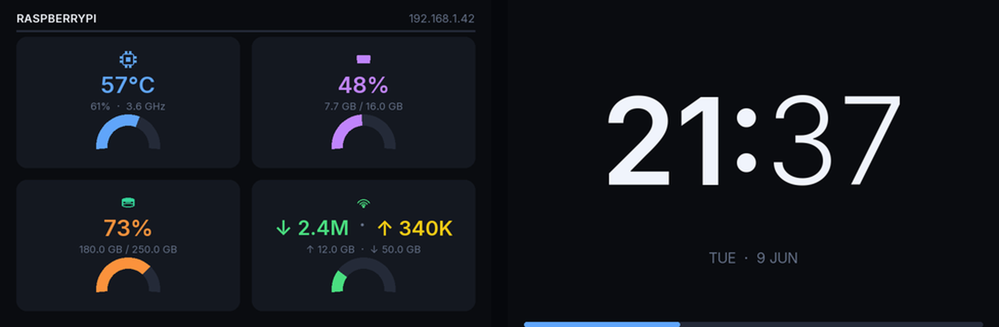

# ax206-display-linux

**A Python system-monitor dashboard for the cheap AX206 USB display** — the 3.5 inch USB screen sold on AliExpress, eBay, and Amazon under many names: *SmartCool*, *QDtech USB Display*, *AIDA64 USB Secondary Screen*, *DPF USB photoframe*, and similar. Runs on Linux (Raspberry Pi, Ubuntu, Debian) and macOS.

<p align="center">
  
  <br>
  <em>Stats screen (left) and clock screen (right) — pixel-identical to what the panel shows.</em>
</p>

---

## What is the AX206 USB display?

It is a small **480 × 320 px landscape LCD panel** with a USB 1.1 connection, built around the AX206 DPF chip. On Windows it works as an AIDA64 secondary monitor or ScreenshotTool display out of the box. On Linux there is no official driver — this project replaces that with a clean open-source Python driver.

The same hardware is sold under many product names:
- SmartCool USB Display / SmartCool Screen
- QDtech 3.5" USB LCD
- AIDA64 USB Secondary Display
- DPF AX206 USB photoframe / digital photo frame
- Geekcreit / DIY USB monitor kit
- Generic "USB mini monitor" from AliExpress / Temu

**USB device ID:** `1908:0102` (vendor `1908`, product `0102`)

---

## Features

| | |
|---|---|
| 🖥️ **Stats screen** | 2 × 2 card grid: CPU temp & speed, RAM usage, disk usage, network throughput |
| 🕐 **Clock screen** | Full-screen HH:MM — bold hours, light minutes, blinking colon, date line, seconds progress bar |
| 🌡️ **Thermal alerts** | Values flip orange at 70 % / 85 °C and red at 85 % / 80 °C |
| 🔄 **Auto-rotate** | Alternates between stats and clock every 3 seconds (configurable) |
| 🔁 **Auto-recovery** | Glitches self-heal via USB Mass-Storage reset; full reopen if needed |
| 🖋️ **Ubuntu font** | Uses Ubuntu font if installed, falls back to bundled Inter |
| 🐧 **Systemd service** | One-line install script sets up udev rules + background service |
| 🍎 **macOS compatible** | Works on macOS with `brew install libusb` |

---

## Hardware compatibility

| Spec | Value |
|---|---|
| Panel resolution | 480 × 320 px, landscape |
| Color depth | RGB565 (65 536 colors) |
| USB | 1.1 Bulk-Only (BOT), ~1.4 full-screen frames per second |
| USB ID | `1908:0102` |
| Protocol | AX206 DPF vendor SCSI commands via libusb |

> **Important:** Only the BLIT command (`0xCD … 0x12`) is implemented by this firmware. GETLCD and SETPROPERTY (brightness) are in the spec but **wedge the USB endpoint** on the SmartCool/QDtech variant — requiring a physical replug. The driver deliberately avoids those calls.

---

## Quick install (Raspberry Pi / Debian / Ubuntu)

```bash
curl -sSL https://raw.githubusercontent.com/ffrafat/ax206-display-linux/main/install.sh | bash
```

This single command:
1. Installs system dependencies (`libusb-1.0`, `python3-venv`, `fonts-liberation`)
2. Clones the repo to `~/ax206-usb-display`
3. Creates a Python virtual environment and installs `pyusb`, `Pillow`, `numpy`, `psutil`
4. Writes a udev rule so the display is accessible without `sudo`
5. Installs and starts a systemd service that auto-starts on every boot

> Unplug and replug the display's USB cable once after the script finishes.

### Optional: Ubuntu font (recommended)

```bash
sudo apt install fonts-ubuntu
```

The dashboard auto-detects and prefers Ubuntu font when available.

---

## Manual setup

### 1 — System dependencies

```bash
sudo apt update
sudo apt install -y git python3-venv python3-dev libusb-1.0-0-dev \
                   build-essential fonts-liberation fonts-ubuntu
```

### 2 — Clone and create virtualenv

```bash
git clone https://github.com/ffrafat/ax206-display-linux.git ~/ax206-usb-display
cd ~/ax206-usb-display
python3 -m venv .venv
.venv/bin/pip install pyusb pillow numpy psutil
```

### 3 — USB permissions (udev rule)

```bash
echo 'SUBSYSTEM=="usb", ATTR{idVendor}=="1908", ATTR{idProduct}=="0102", MODE="0666"' \
  | sudo tee /etc/udev/rules.d/99-ax206.rules
sudo udevadm control --reload-rules && sudo udevadm trigger
```

Replug the display's USB cable after this step.

### 4 — Verify the display is detected

```bash
.venv/bin/python show_image.py --test
```

A colour test pattern should appear on the screen.

---

## Running the dashboard

### Foreground (manual)

```bash
.venv/bin/python sysdash.py
```

Press `Ctrl-C` to stop.

### Background service (systemd)

```bash
# Create service file
cat << EOF | sudo tee /etc/systemd/system/ax206.service
[Unit]
Description=AX206 USB Display System Monitor
After=network.target

[Service]
Type=simple
User=$USER
WorkingDirectory=$HOME/ax206-usb-display
ExecStart=$HOME/ax206-usb-display/.venv/bin/python sysdash.py
Restart=always
RestartSec=5

[Install]
WantedBy=multi-user.target
EOF

sudo systemctl daemon-reload
sudo systemctl enable --now ax206.service
```

**Service management:**

```bash
sudo systemctl status ax206       # check running state
sudo journalctl -u ax206 -f       # live log output
sudo systemctl restart ax206      # restart after code change
sudo systemctl stop ax206         # stop
```

---

## Command-line options

```
sysdash.py [--clock-secs N] [--stats-secs N] [--interval N] [--frames N]

  --clock-secs N   Seconds to show the clock screen (default: 3)
  --stats-secs N   Seconds to show the stats screen (default: 3)
  --interval N     Frame update interval in seconds (default: 1.0)
  --frames N       Exit after N frames, 0 = run forever (default: 0)
```

---

## Update and uninstall

```bash
# Update to latest code
cd ~/ax206-usb-display && ./update.sh

# Full uninstall (removes service, udev rule, and repo directory)
cd ~/ax206-usb-display && ./uninstall.sh
```

---

## macOS setup

```bash
brew install libusb
git clone https://github.com/ffrafat/ax206-display-linux.git ~/ax206-usb-display
cd ~/ax206-usb-display
python3 -m venv .venv
.venv/bin/pip install pyusb pillow numpy psutil
.venv/bin/python sysdash.py
```

---

## File overview

| File | Purpose |
|---|---|
| `ax206.py` | USB driver — `AX206Display` class, CBW/CSW transport, RGB565 conversion |
| `sysdash.py` | Dashboard renderer — stats cards, clock, arc gauges, font handling |
| `show_image.py` | CLI utility to push a single image, solid colour, or test pattern |
| `assets/fonts/` | Bundled Inter font family (Light / Regular / SemiBold) |
| `install.sh` | Automated setup: deps, venv, udev rule, systemd service |
| `update.sh` | Pull latest code and restart service |
| `uninstall.sh` | Remove service, udev rule, and directory |

---

## Protocol notes (for developers)

- **Transport:** USB Mass Storage Bulk-Only Transport (BOT). Endpoints: `EP 0x01 BULK OUT`, `EP 0x81 BULK IN`.
- **Command format:** 31-byte CBW (`USBC` signature) + pixel data + 13-byte CSW (`USBS` signature).
- **Only one vendor command works:** BLIT (`CDB[0]=0xCD, CDB[6]=0x12`). Sending GETLCD or SETPROPERTY hangs the OUT endpoint on this firmware — confirmed on hardware.
- **Pixels:** RGB565 big-endian. `byte0 = (R & 0xF8) | (G >> 5)`, `byte1 = ((G & 0x1C) << 3) | (B >> 3)`.
- **Rendering:** Frames are drawn at 960 × 640 (2× supersampling) then downscaled to 480 × 320 with LANCZOS for crisp sub-pixel text.
- **Recovery:** USB glitches → `recover()` (Mass-Storage reset + `clear_halt`). Persistent errors → `reopen()` (close + reopen device handle). Six consecutive failures → exit with code 1.

---

## Credits & attribution

- [sunzhengya/ax206-usb-display-macos](https://github.com/sunzhengya/ax206-usb-display-macos) — original clean macOS driver and dashboard this project is forked from
- [dreamlayers/dpf-ax](https://github.com/dreamlayers/dpf-ax) — authoritative reverse-engineered AX206 command set documentation
- [mathoudebine/turing-smart-screen-python](https://github.com/mathoudebine/turing-smart-screen-python) — reference for USB info-display projects in Python

---

## License

GPL-3.0 — see [LICENSE](LICENSE).
