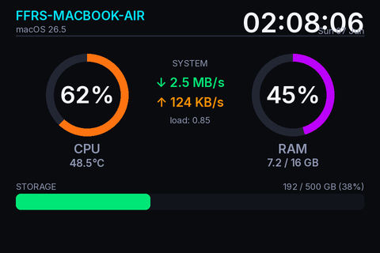

# ax206-smartcool-sysmon-linux

Drives the small 3.5" "QDtech USB-Display" (USB id `1908:0102`, sold as an
AIDA64 secondary screen and based on the SmartCool AX206 firmware variant) over libusb. This project is a tailored Linux system monitor dashboard, but maintains cross-platform compatibility with macOS.

Panel: **480×320 landscape, RGB565, USB 1.1** (~1.4 full-screen fps).

<p align="center">
  
  <br>
  <em>sysdash.py output (rendered frame — pixel-identical to what the panel shows)</em>
</p>

## Credits & Attribution
This project is a fork of and heavily based on:
- [sunzhengya/ax206-usb-display-macos](https://github.com/sunzhengya/ax206-usb-display-macos) — the original clean driver and macOS dashboard.
- [dreamlayers/dpf-ax](https://github.com/dreamlayers/dpf-ax) — the authoritative source for the DPF AX206 CBW/BLIT command set.
- [mathoudebine/turing-smart-screen-python](https://github.com/mathoudebine/turing-smart-screen-python) — reference codebase for USB info-displays.

---

## Files
- `ax206.py` — the driver (`AX206Display`: `open`, `blit`, `fill`, `draw_image`, `recover`, `reopen`)
- `show_image.py` — CLI to show an image / solid color / test pattern
- `sysdash.py` — alternates clock (3s) and stats (3s): full-screen HH:MM clock + 2×2 system cards
- `assets/fonts/` — optional Inter fonts for consistent rendering (falls back to Liberation Sans / Arial)

---

## Installation & Setup (Debian-based Linux)

### Automatic Setup (Recommended)
You can set up everything (system libraries, python environment, udev rules, and the background systemd service) by running this automated command:
```bash
curl -sSL https://raw.githubusercontent.com/ffrafat/ax206-display-linux/main/install.sh | bash
```
*⚠️ Note: Unplug the display's USB cable and plug it back in after the script finishes to apply permissions.*

### Update & Uninstall
* **To update to the latest code:**
  ```bash
  cd ~/ax206-usb-display && ./update.sh
  ```
* **To completely uninstall:**
  ```bash
  cd ~/ax206-usb-display && ./uninstall.sh
  ```

---

### Manual Setup Steps (Alternative)
If you prefer to set up the environment manually:

1. Install system dependencies:
   ```bash
   sudo apt update
   sudo apt install -y git python3-venv python3-dev libusb-1.0-0-dev build-essential fonts-liberation
   ```

2. Clone repository & install packages:
   ```bash
   git clone https://github.com/ffrafat/ax206-display-linux.git ~/ax206-usb-display
   cd ~/ax206-usb-display
   python3 -m venv .venv
   .venv/bin/pip install pyusb pillow numpy psutil
   ```

3. Setup USB permissions (udev):
   ```bash
   echo 'SUBSYSTEM=="usb", ATTR{idVendor}=="1908", ATTR{idProduct}=="0102", MODE="0666"' | sudo tee /etc/udev/rules.d/99-ax206.rules
   sudo udevadm control --reload-rules
   sudo udevadm trigger
   ```
   *Unplug and replug the display's USB cable after setting this rule.*

---

## Usage

### Test Screen Output
Verify the connection and screen rendering:
```bash
.venv/bin/python show_image.py --test
```

### Run Dashboard in Foreground
```bash
.venv/bin/python sysdash.py
```
*(Press `Ctrl-C` to stop)*

### Run Dashboard as a Background Service (Systemd)
To run the dashboard continuously in the background and start automatically on boot:

1. Create a service file:
   ```bash
   cat << EOF | sudo tee /etc/systemd/system/ax206.service
   [Unit]
   Description=AX206 USB Display System Monitor
   After=network.target

   [Service]
   Type=simple
   User=$USER
   WorkingDirectory=$HOME/ax206-usb-display
   ExecStart=$HOME/ax206-usb-display/.venv/bin/python sysdash.py
   Restart=always
   RestartSec=5

   [Install]
   WantedBy=multi-user.target
   EOF
   ```

2. Register and start the daemon:
   ```bash
   sudo systemctl daemon-reload
   sudo systemctl enable ax206.service
   sudo systemctl start ax206.service
   ```

3. Manage the background daemon:
   - **View status:** `sudo systemctl status ax206`
   - **Read logs:** `sudo journalctl -u ax206 -f`
   - **Stop process:** `sudo systemctl stop ax206`

---

## Setup on macOS
For local testing or use on macOS:
```bash
brew install libusb
python3 -m venv .venv
.venv/bin/pip install pyusb pillow numpy psutil
.venv/bin/python sysdash.py
```

---

## Protocol notes
- Geometry is fixed **480×320 landscape**. Pixels are **RGB565 big-endian**.
- Transport is USB Mass-Storage Bulk-Only: 31-byte CBW (`USBC`…) + data + 13-byte CSW (`USBS`…).
- **BLIT (CDB op `0x12`) is the ONLY command this firmware implements.** Any other vendor command — SCSI INQUIRY, GETLCD, SETPROPERTY/brightness — times out and **wedges the USB endpoint**, requiring a physical unplug/replug to recover.
- Occasional CSW glitches self-heal via `recover()` (MSC reset + clear_halt) / `reopen()`.

## License
GPL-3.0. See [LICENSE](LICENSE).
