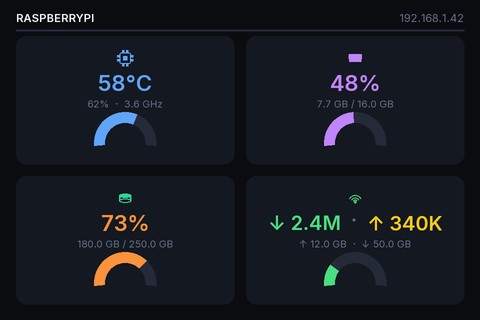
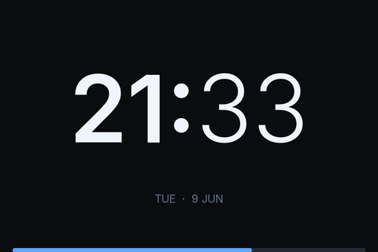
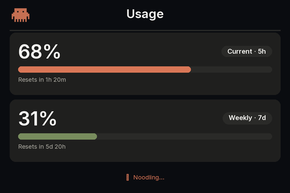

# ax206-display

**A Python dashboard for the AX206 USB display** — the cheap 480×320 USB screen sold on AliExpress, eBay, and Amazon as *SmartCool*, *QDtech USB Display*, *AIDA64 USB Secondary Screen*, *DPF USB photoframe*, and similar.

Runs on **Linux**, **macOS**, and **Windows** — no official driver needed.

---

## Screens

The three built-in screens rotate every 10 seconds. They are **sample screens** — the rendering is plain Python + Pillow, so you can display anything you can draw: custom metrics, alerts, weather, stock prices, home automation status, whatever. No special framework required.

<table>
<tr>
  <td align="center"><b>Stats</b></td>
  <td align="center"><b>Clock</b></td>
  <td align="center"><b>Claude Usage</b></td>
</tr>
<tr>
  <td></td>
  <td></td>
  <td></td>
</tr>
<tr>
  <td>CPU temp &amp; speed, RAM, Disk, Network throughput — each with arc gauge</td>
  <td>Full-screen HH:MM, blinking colon, date line, seconds progress bar</td>
  <td>Claude API usage meters — current 5h window &amp; weekly, with live reset countdown</td>
</tr>
</table>

---

## What is the AX206 USB display?

A small **480 × 320 px landscape LCD** with a USB 1.1 connection, built on the AX206 DPF chip. On Windows it works as an AIDA64 / ScreenshotTool secondary monitor out of the box. On Linux and macOS there is no official driver — this project replaces that with a clean Python driver.

Sold under many names:
- SmartCool USB Display / SmartCool Screen
- QDtech 3.5" USB LCD
- AIDA64 USB Secondary Display
- DPF AX206 USB photoframe / digital photo frame
- Generic "USB mini monitor" from AliExpress / Temu

**USB device ID:** `1908:0102`

---

## Features

| | |
|---|---|
| 🖥️ **Stats screen** | CPU temp & speed, RAM, disk, network — each card with an arc gauge |
| 🕐 **Clock screen** | Full-screen HH:MM with blinking colon, date line, seconds bar |
| 🤖 **Claude usage screen** | Live Anthropic API usage — 5h current & 7d weekly with reset countdown |
| 🌡️ **Thermal alerts** | Values flip orange at 70% / red at 85% |
| 🔄 **Auto-rotate** | Cycles through all screens every 10 s (configurable) |
| 🔁 **Auto-recovery** | USB glitches self-heal; full reopen if needed |
| 🖋️ **Font fallback** | Ubuntu font → bundled Inter → system default |
| 🐧 **Linux service** | Systemd + udev install script for Raspberry Pi / Debian / Ubuntu |
| 🍎 **macOS** | Works with `brew install libusb` |
| 🪟 **Windows** | Run via Task Scheduler for silent background autostart |

---

## Platform setup

### Linux (Raspberry Pi / Debian / Ubuntu)

```bash
curl -sSL https://raw.githubusercontent.com/ffrafat/ax206-display-linux/main/install.sh | bash
```

This installs system deps, clones the repo, creates a venv, writes a udev rule, and starts a systemd service.

**Optional — Ubuntu font (recommended):**
```bash
sudo apt install fonts-ubuntu
```

<details>
<summary>Manual setup</summary>

```bash
sudo apt update
sudo apt install -y git python3-venv python3-dev libusb-1.0-0-dev \
                   build-essential fonts-liberation fonts-ubuntu

git clone https://github.com/ffrafat/ax206-display-linux.git ~/ax206-usb-display
cd ~/ax206-usb-display
python3 -m venv .venv
.venv/bin/pip install pyusb pillow numpy psutil

# USB permissions
echo 'SUBSYSTEM=="usb", ATTR{idVendor}=="1908", ATTR{idProduct}=="0102", MODE="0666"' \
  | sudo tee /etc/udev/rules.d/99-ax206.rules
sudo udevadm control --reload-rules && sudo udevadm trigger
```

Replug the USB cable, then run `.venv/bin/python sysdash.py`.

</details>

<details>
<summary>Systemd service</summary>

```bash
cat << EOF | sudo tee /etc/systemd/system/ax206.service
[Unit]
Description=AX206 USB Display System Monitor
After=network.target

[Service]
Type=simple
User=$USER
WorkingDirectory=$HOME/ax206-usb-display
ExecStart=$HOME/ax206-usb-display/.venv/bin/python sysdash.py
Restart=always
RestartSec=5

[Install]
WantedBy=multi-user.target
EOF

sudo systemctl daemon-reload
sudo systemctl enable --now ax206.service
```

```bash
sudo systemctl status ax206       # check state
sudo journalctl -u ax206 -f       # live logs
sudo systemctl restart ax206      # restart after code change
```

</details>

---

### macOS

```bash
brew install libusb
git clone https://github.com/ffrafat/ax206-display-linux.git ~/ax206-usb-display
cd ~/ax206-usb-display
python3 -m venv .venv
.venv/bin/pip install pyusb pillow numpy psutil
.venv/bin/python sysdash.py
```

---

### Windows

```powershell
git clone https://github.com/ffrafat/ax206-display-linux.git C:\ax206-display
cd C:\ax206-display
python -m venv .venv
.venv\Scripts\pip install pyusb pillow numpy psutil
python sysdash.py
```

**Silent background autostart via Task Scheduler:**

1. `Win+R` → `taskschd.msc`
2. **Create Basic Task** — trigger: *When the computer starts*
3. Action: *Start a program*
   - Program: `C:\Users\<you>\AppData\Local\Programs\Python\Python312\pythonw.exe`
   - Arguments: `C:\ax206-display\sysdash.py`
   - Start in: `C:\ax206-display`

Or use the included `run_sysdash.bat` as a shortcut in the Startup folder.

---

## Claude usage screen

The Claude usage screen reads the OAuth token that **Claude Code** already stores on your machine — no separate API key needed. Just make sure you've run `claude login` at least once.

- **Token location:** `~/.claude/.credentials.json` (all platforms)
- **What it shows:** your current 5-hour usage window + 7-day weekly window, with live countdown to each reset
- **Polling:** once every 60 seconds in a background thread; the display updates each rotation

If the token is missing or expired, the status line shows `run: claude login`.

---

## Building your own screen

The dashboard is just Python + [Pillow](https://pillow.readthedocs.io/). To add a screen:

1. Write a `render_myscreen() -> Image.Image` function that returns a `480×320` PIL image
2. Add it to `SCREEN_ORDER` and `SCREEN_SECS` in `main()`

The existing screens (`render_stats`, `render_clock`, `render_claude_usage`) are good references. Everything is drawn with standard Pillow primitives — `rounded_rectangle`, `text`, `arc`, `pieslice`. The 2× supersampling (draw at 960×640, downsample to 480×320) is handled automatically.

---

## Command-line options

```
sysdash.py [--clock-secs N] [--stats-secs N] [--interval N] [--frames N]

  --clock-secs N   Seconds to show the clock screen  (default: 10)
  --stats-secs N   Seconds to show the stats screen  (default: 10)
  --interval N     Frame update interval in seconds   (default: 1.0)
  --frames N       Exit after N frames, 0 = forever  (default: 0)
```

---

## File overview

| File | Purpose |
|---|---|
| `ax206.py` | USB driver — `AX206Display`, CBW/CSW transport, RGB565 conversion |
| `sysdash.py` | Dashboard — stats, clock, Claude usage screens + all rendering |
| `show_image.py` | Push a single image, solid colour, or test pattern to the display |
| `run_sysdash.bat` | Windows launcher (use with Task Scheduler for autostart) |
| `octopus-icon.png` | Pixel-art octopus used in the Claude usage screen header |
| `assets/fonts/` | Bundled Inter font family (Light / Regular / SemiBold) |
| `install.sh` | Automated Linux setup: deps, venv, udev rule, systemd service |
| `update.sh` | Pull latest code and restart service |
| `uninstall.sh` | Remove service, udev rule, and directory |

---

## Protocol notes

- **Transport:** USB Mass Storage Bulk-Only (BOT). Endpoints `EP 0x01 BULK OUT` / `EP 0x81 BULK IN`.
- **Only BLIT works:** `CDB[0]=0xCD, CDB[6]=0x12`. GETLCD and SETPROPERTY wedge the OUT endpoint on this firmware.
- **Pixels:** RGB565 big-endian. `byte0 = (R & 0xF8) | (G >> 5)`, `byte1 = ((G & 0x1C) << 3) | (B >> 3)`.
- **Rendering:** 2× supersampling (960×640 → 480×320 LANCZOS) for crisp sub-pixel text.
- **Recovery:** USB glitch → `recover()` (reset + clear_halt). Six consecutive failures → exit 1.

---

## Credits

- [sunzhengya/ax206-usb-display-macos](https://github.com/sunzhengya/ax206-usb-display-macos) — original macOS driver this project is forked from
- [dreamlayers/dpf-ax](https://github.com/dreamlayers/dpf-ax) — reverse-engineered AX206 command set
- [mathoudebine/turing-smart-screen-python](https://github.com/mathoudebine/turing-smart-screen-python) — reference for USB info-display projects in Python

---

## License

GPL-3.0 — see [LICENSE](LICENSE).
